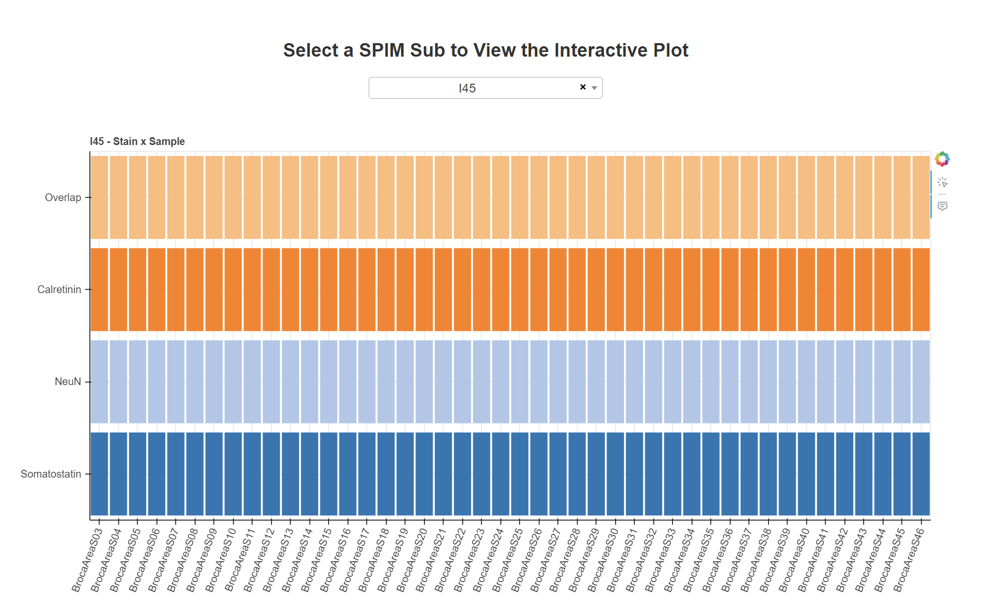

# DANDI_Interactive_Plot_Selector
This repo contains a python script and also a jupyter notebook that creates a Interactive Plot Selector HTML page for DANDI dataset.

<div align="center">
    
</div>


# Setting Up a Python Virtual Environment with a Hidden `.venv` Directory


## Pre-requisites
1. **Python 3.x**: Ensure Python is installed in your environment.
   - Check your Python version:
     ```bash
     python3 --version
     ```
   - If Python is not installed, install it:
     ```bash
     sudo apt update
     sudo apt install python3 python3-venv python3-pip
     ```

2. **Virtual environment module**: The `venv` module is typically included with Python 3.x. If not, install it using:
```bash
sudo apt install python3-venv
 ```


## Step 1: Create a Python Virtual Environment

1. Navigate to this git-repo directory in your terminal.

2. Create a virtual environment named `.venv` to keep it hidden:
```bash
python3 -m venv .venv
```


## Step 2: Activate the Virtual Environment

+ Activate the virtual environment in terminal:
```bash
source .venv/bin/activate
```
> After activation, the terminal prompt will indicate the active environment, typically by showing `(venv)`.


## Step 3: Deactivate the Virtual Environment

+ To deactivate the virtual environment, run:
```bash
deactivate
```


# Install Project Dependencies

To install the dependencies (which will be isolated in this environment) after activating the virtual environment, run:
```bash
pip install -r requirements.txt
```


# Running *Python Script* or *Jupyter Notebook*

The main purpose of the *Python Script* is to create the `DANDI_interactive_plot_selector.html`, an interactive plot selector HTML page. The *Jupyter Notebook* is primarily used for testing purposes

## The Python Script - `dashboard.py`
After activating the virtual environment, run:
```bash
python3 dashboard.py
```
 + Upon complition you will see this message:
    ```bash
    HTML file generated as 'DANDI_interactive_plot_selector.html'
    ```
    `DANDI_interactive_plot_selector.html` is the webpage containing the interactive plots.

> Note: Along with the `DANDI_interactive_plot_selector.html` file, `dashboard.py` also creates a `./plots` folder, which contains all the interactive plots for the *subjects* as well as the *Modality X Subject* plot, which are used by the `DANDI_interactive_plot_selector.html` file.


## The Jupyter Notebook - `dashboard.ipynb`

1. Open the `dashboard.ipynb` jupyter notebook either in you IDE (e.g., VS Code) or via jupyter notebook environment interface (in you terminal run: ```jupyter notebook```) and select `dashboard.ipynb` in the web interface.

2. Select the Kernel `.venv (Python {version})` using the `Select Kernel` option.

3. Run the cells, play around and enjoy!

> Note: The `dashboard.ipynb` creates an additional folder `./objs` along with `DANDI_interactive_plot_selector.html` and `./plots`. The `./objs` folder contains *pickle* objects as checkpoint files, this allows users to avoid reloading or filtering the data repeatedly when testing during later stages of the notebook.


